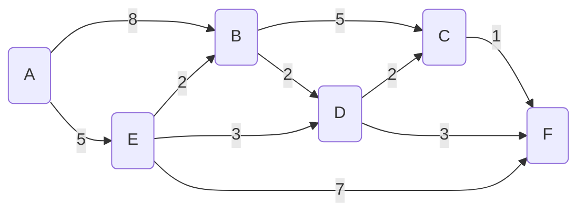

# Bellman Ford Algorithm

Find the **shortest path** between A and all other nodes

Note: can be used with negative weights

## Algorithm
- Set starting node A distance to 0 and all other distances to infinity &infin;
- Repeat N - 1 times, where N is the number of nodes
  - Cycle through all edges (may be helpful to keep edge list ie. A-B, A-E, B-C, B-D, C-F, D-C, D-F, E-B, E-D, E-F)
    - Update distance if the distance is lower to adjacent nodes (update the Distance, Previous, and Path)
    
### Completed
| Previous | | A, E | B, D, D | B, E | A | C, D, E, D | | 
| --- | --- | --- | --- | --- | --- |--- | --- |
| **Node** | **A** | **B**   | **C**   | **D**   | **E**   | **F** |  |
| Distance  |  **0**   | &infin; | &infin; | &infin; | &infin; | &infin; |  |
|           |  0   |   **8**     |   **13**    |  **10**     |  **5**     |   **14**    |   |
|           |  0   |   **7**     |   **12**    |  **8**      |   5     |   **13**    |   |
|           |  0   |   7     |   12     |  8      |   5     |   **12**    | After 1st iteration |
|  |  |  |  |  |  |  |  |
|           |  0   |   7     |   **10** |  8      |   5     |   **11**    | After 2nd iteration |
|  |  |  |  |  |  |  |  |
|           |  0   |   7     |   1 |  8      |   5     |   11    | After 3rd iteration - no change, thus done|

---
Note: Edge list order will affect the number of iterations, but will be at most N-1 where N is number of nodes

Note: Path can be determined by Prev or can update when shorter path found

-- end --

