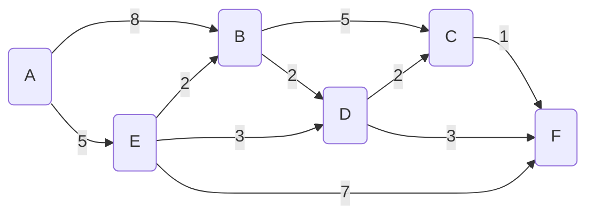

# Dijkstra's Algorithm

Find the **shortest path** between A and all other nodes

## Algorithm
- Set starting node A distance to 0 and all other distances to infinity
- Mark all nodes as `unvisited`
- While unvisited nodes remain
  - select unvisited node with lowest distance
  - update the distance (if lower) to adjacent nodes (update Distance, Prev and Path)
  - mark this node as visited

   

