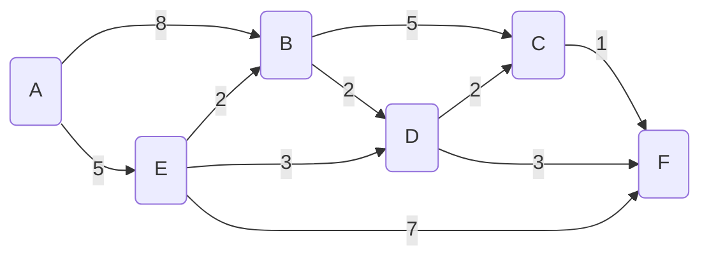

# Dijkstra's Algorithm

Find the **shortest path** between A and all other nodes

Note: cannot be used with negative wieghts

## Algorithm
- Set starting node A distance to 0 and all other distances to infinity &infin;
- Mark all nodes as `unvisited`
- While unvisited nodes remain
  - select unvisited node with lowest distance
  - update the distance (if lower) to adjacent nodes (update Distance, Prev and Path)
  - mark this node as visited

### Start
| Visited | Node | Distance | Pref | Path |
| --- | --- | --- | --- | --- |
|  | A |  |  |  |
|  | B |  |  |  |
|  | C |  |  |  |
|  | D |  |  |  |
|  | E |  |  |  |
|  | F |  |  |  |

---
### Completed
| Visited | Node | Distance | Previous | Path |
| --- | --- | --- | --- | --- |
| v1 | A | **0** |  |  |
| v3 | B | &infin;, 8, **7** | A, **E** | A->E->B |
| v5 | C | &infin;, 12, **10** | B, **D** | A->E->D->C |
| v4 | D | &infin;, **8** | **E** | A->E->D |
| v2 | E | &infin;, **5** | A | A->E |
| v6 | F | &infin;, 12, **11** | E, **D** | A->E->D->F |

-- end --

