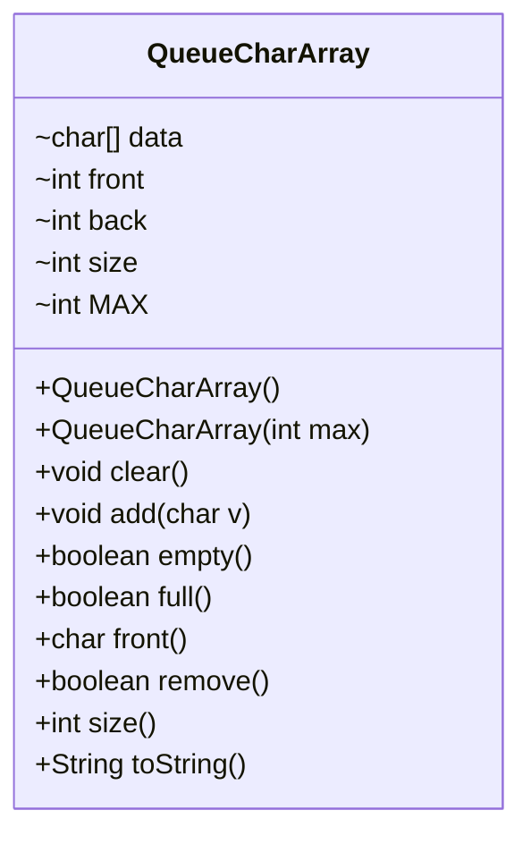

# Lab #4 Part A - OOP Queue with Character Array
- CS325 Data Structures  
- 15 points
- Due **Thursday**, September 18th at 5:00 pm

---

## Purpose

The purpose of this assignment is to build and use a **queue** using
an **object-oriented programming (OOP)** approach.

---

## Requirements
1. Write the class `QueueCharArray` that implements an ADT for a queue that can store the Java char type using an array.
2. Modify code file `QueueCharArray.java` given below.
2. Implement the methods shown in the UML diagram. 
3. Add comments throughout your program to describe your design.  Add your first and last name to the comments. 
4. Test your class using `testQueue.java` code provided. Add additional test cases to verify your understangin.
5. Use the class `StackCharArray` that implements an ADT for a stack that can store the Java char type using an array as a template.

Note:
- Default queue size must be 5
-  Alternate constructor sets maximum queue size
- If queue is empty, front() should return ‘?’
- Feel free to use private data items shown or create your own to support your class

---
## UML Diagram



---

## Starter Code for QueueCharArray

`QueueCharArray.java` stores the code to define the class.

```java
/*
 * QueueCharArray.java
 * fall 2025
 * prof. lehman
 * 
 * Queue approach has first and last point
 * to first and last elements in array.
 * The variable size is used to denote
 * an empty vs. full queue
 */
public class QueueCharArray {

	// data
	char data[];
	int front;
	int back;
	int size;
	int MAX;

	// default constructor
	public QueueCharArray() {

	}

	// alternate constructor
	public QueueCharArray(int max) {

	}

	// delete all items in queue
	public void clear() {

	}

	// add to back of queue
	public void add(char v) {

	}

	// see if queue is empty
	public boolean empty() {
		return true;
	}

	// see if queue is full
	public boolean full() {
		return true;
	}

	// return element from front of queue
	public char front() {
		return 'X';
	}

	// remove element from front of queue
	public boolean remove() {
		return true;
	}

	public int size() {
		return -1;
	}

	 /**
     * use with println to display queue
     * 
     * @return set as a String
     */
    public String toString() 
	{
		return "QUEUE";
    }
}// class

```

## Test Code for QueueCharArray

`testQueue.java` is used to test yur QueueCharArray class.

To run from the command line, compile your QueueCharArray class, then your test class, then run the test class.

```bash
javac QueueCharArray.java
javac testQueue.java
java testQueue
```


```java
/*
 * testQueue.java
 * fall 2025
 * prof. lehman
 * 
 * tests QueueCharArray class
 */
 
public class testQueue {

	public static void main(String[] args) {

		QueueCharArray q = new QueueCharArray(); // default constructor

		q.add('a');
		q.add('b');
		q.add('c');
		q.add('d');
		q.add('e');
		System.out.println("size: " + q.size()); // 5

		q.add('f');// no error shown
		System.out.println("size: " + q.size()); // 5

		q.remove();
		System.out.println("size: " + q.size()); // 4
		q.add('f');

		q.remove();
		System.out.println("size: " + q.size()); // 4

		q.add('f');
		System.out.println("size: " + q.size()); // 5

		System.out.println(q.front()); // c
		System.out.println("size: " + q.size());// 5

		q.remove();

		System.out.println(q.front());// d
		System.out.println("size: " + q.size()); // 4

		q.clear();

		System.out.println();
		System.out.println(q.front()); // ? denotes empty
		System.out.println(q.size()); // 0

		QueueCharArray b = new QueueCharArray(100);
		b.add('a');
		b.add('b');
		b.add('c');
		b.add('d');
		b.add('e');

		System.out.println();
		System.out.println(b.front()); // a
		System.out.println("size: " + b.size()); // 5

		while (!b.empty()) {
			System.out.println(b.front()); // a b c d e
			b.remove();
		}

		System.out.println();
		System.out.println(q.front()); // ? denotes empty
		System.out.println("size: " + q.size()); // 0

	}// main

}// class
```

---
## Submitting your assignment

Host `QueueCharArray.java` on your GitHub account and **upload a link to your code in Moodle**

Note: You are not submitting your testQueue.java code.

-- end --
