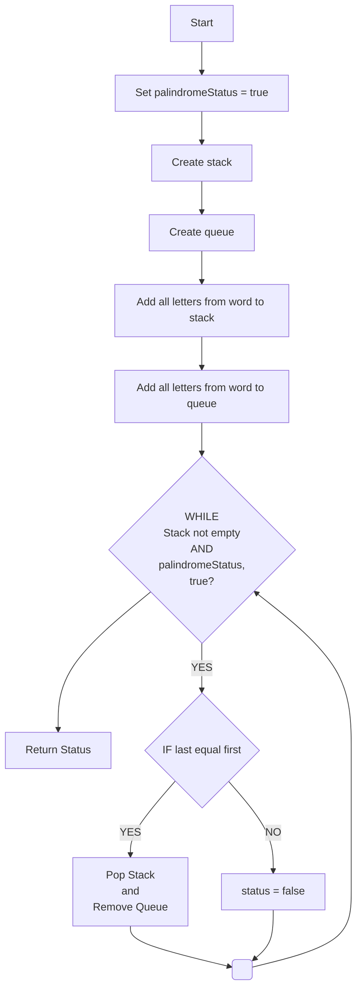

# Lab #4 Part B -  Palindrome
- CS325 Data Structures  
- 10 points
- Due **Tuesday**, September 23rd at 5:00 pm

---

## Purpose

The purpose of this assignment is to use the `StackCharArray` and `QueueuCharArray` classes to determine 
if a word is a palindrome. A palindrome is a word that is spelled the same forward and backward.

---

## Requirements
1. Implement the palindrome method using the `StackCharArray` and `QueueuCharArray` classes. 
2. Modify the `palindrome.java` code below implmenting the `palindrome` method. Feel free to add additional test cases.
3. You must use the following algorithm shown in pseudocode. 

## Palindrome Algorithm (Pseudocode)
```bash
Assume palindrome status is true
Create stack
Create queue
Add all letters from word to stack
Add all letters from word to queue

While stack is not empty and palindrome status is true
   if stack.top() not equal to queue.front()
      palindrome status is false
   else
      pop char from stack, remove char from queue

Return palindrome status
```


---

## Starter Code for QueueCharArray

`palindrome.java` stores the code to define the class.

```java
/// palindrome.java 
//
// fall 2025
// lab4b assignment
//
//  *** add your name here
//
// Use for paindrome.java

public class palindrome {
    
    public static void main(String[] args) {

        //single call to test
        System.out.println( palindrome("racecar") ); //true
        System.out.println( palindrome("sass") ); //false

        //uncomment to test additional words
        /*
        String words[] = { "a", "racecar", "noon", "hannah", "abcba", "abbca", "nope", "ab" };

        for (int i = 0; i < words.length; i++) {

            if (palindrome(words[i]) == true)
                System.out.println( words[i] + " IS a palindrome");
            else
                System.out.println( words[i] + " IS NOT a palindrome");
        }
        */
        
    }// main

    // *** use StackCharArray and QueueCharArray here to determine Palindrome
    private static boolean palindrome(String word) {

        //assume status is true
        boolean status = true;

		// *** add code here

        return status;
        
    }// palindrome method

}//class

```

## Testing

To run from the command line, compile `palindrome.java`, then run the `palindrome.class` file.

```bash
javac palindrome.java
java palindrome
```

---
## Submitting your assignment

Host `palindrome.java` on your GitHub account and **upload a link to your code in Moodle**

-- end --
