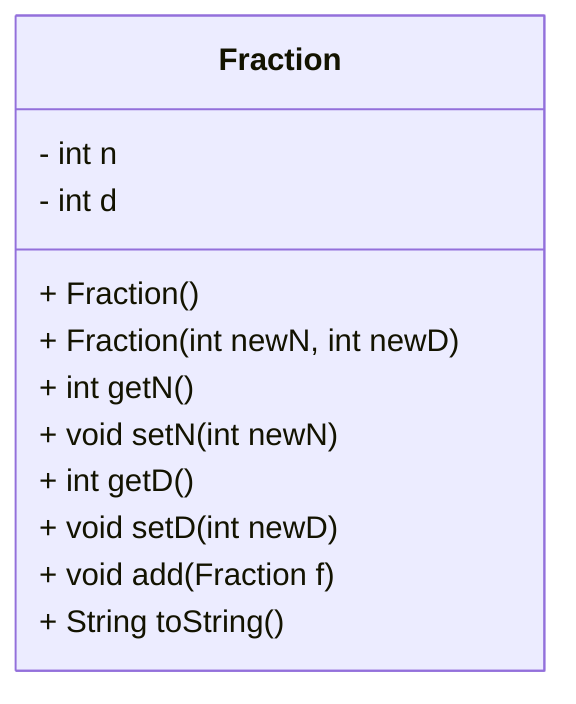

# OOP Example - Fraction

Objects help us organize and reuse code.  Objects are defined in class files and include **data** and **methods**.  

The `Fraction` class is like a recipe card for making fractions. Instead of flour and sugar, it stores two important ingredients: a numerator (n) and a denominator (d). 
These are kept private, which means no one outside the class can mess with them directly, kind of like locking your snacks in a cupboard so your little brother/sister
can’t eat them. To change or read those numbers, you use special “helpers” called getters and setters. 
The class also has constructors, which are like the starting instructions for building a fraction (you can start with the default 1/1 or give it your own numbers). Notice that the constructor name is the same as the class name. 
The add method shows how one fraction can team up with another to make a bigger fraction, and the toString method is what lets the fraction politely introduce itself when you print it out.

The `FractionTest` class is the playground where we actually use the Fraction recipe. It holds the main method, which is like the “Start Game” button for the program. 
Here, you create Fraction **instance** objects and call the methods to use the fractions. A key idea is that the testing code is separate from the Fraction blueprint.

Think of `Fraction` as the cookie recipe and `FractionTest` as the kitchen where you bake and taste the cookies!


# Fraction UML

**UML** (Unified Modeling Language) models are diagrams that show how class is defined. The show the data (top) and methods (below). Data can be either private (-) or public (+).  Methods may return a value (int) or may not return a value (void).


---

# FractionTest.java (Test Fraction Class)
```java
```
// FractionTest.java
// j.l. lehman
// spring 2025
// test for class Fraction

public class FractionTest {

    public static void main(String[] args) {

        //System.out.println("test");

        //              int n1 = 1;
        //              int d1 = 2;
        //
        //              int n2 = 1;
        //              int d2 = 2;

        //create an instance of the fraction class
        //using the alternate constructor
        //instances are "a" and "b"
        Fraction a = new Fraction(1,2);
        Fraction b = new Fraction(3,4);

        //create an instance of the fraction class
        //using the default constructor
        Fraction c = new Fraction();

        //use the toString method for each instance
        //note: toString is called by default
        System.out.println( a );
        System.out.println( b.toString() );
        System.out.println( c );


        //if class data is public, it can be
        //referenced directly
        //System.out.println( a.n );

        //call set methods
        a.setN(7000);
        a.setD(8000);
        System.out.println( a );

        //error checking in class prevents setting the denominator to zero
        a.setD( 0 );
        System.out.println( a );

        //call get methods
        System.out.println( "Numerator for a is: " + a.getN() );
        System.out.println( "Denominator for a is: " + a.getD() );

        //add two fractions
        Fraction x = new Fraction(5,8);
        Fraction y = new Fraction(3,4);

        System.out.printf( "%s + %s = ", x, y);
        x.add(y);
        System.out.printf( "%s\n", x);

    }//main
}//class
---

# Fraction.java (Class Definition)
```java
//Fraction.java
//j.l. lehman
//spring 2025
//demonstrates basic OOD/OOP

public class Fraction {

    //data
    private int n;
    private int d;

    //constructor(s)

    //default constructor
    public Fraction()
    {
        //System.out.println("*** in default constructor ***");
        n = 1;
        d = 1;
    }

    //alternate constructor
    public Fraction(int newN, int newD)
    {
        //System.out.println("*** in alternate constructor ***");
        n = newN;
        d = newD;
    }

    //getters and setters
    public int getN() {
        return n;
    }

    public void setN(int newN) {
        //this.n = newN;
        n = newN;
    }

    public int getD() {
        return d;
    }

    public void setD(int newD) {
        if (newD != 0)
            d = newD;
    }

    //other methods

    //add to current fraction
    public void add(Fraction f) {
        //add using cross-multiplication
        this.setN( n * f.getD() + d * f.getN());
        this.setD( d * f.getD());
    }

    //toString is inherited from parent, thus an override is needed
    @Override public String toString() {
    return  n + "/" + d;
    }

}//class
```

-- end --
